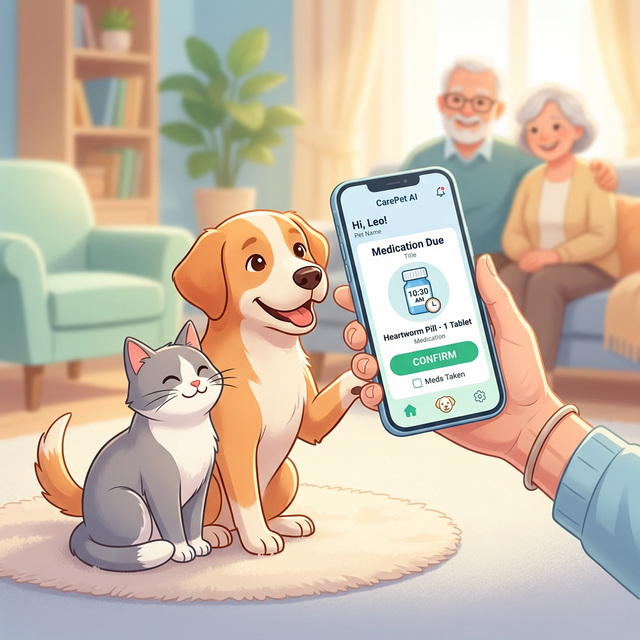

# 🐾 CarePet AI: 智慧長者用藥與健康管理系統



[](https://flet.dev)
[](https://python.org)
[](https://opensource.org/licenses/MIT)

## 🌟 專案簡介

**CarePet AI** 是一款專為長者設計的「遊戲化」用藥管理 App。透過可愛的寵物互動與任務系統，將枯燥的用藥提醒轉化為有趣的日常陪伴，旨在提高長者用藥依從性，並讓家屬隨時掌握長輩的健康狀況。

## 📸 視覺呈現 (Showcase)

這裡可以放入您的 App 截圖或操作影片（GIF）。
> [!TIP]
> 您可以將自己的截圖命名為 `screenshot1.png` 並放入 `assets/images/` 資料夾，然後在此引用。

---


## ✨ 核心特色

- **🐶 寵物陪伴系統**：每日按時服藥可獲得點數，用於餵食、清潔與陪伴寵物，提升參與感。
- **📸 智慧影像辨識**：掃描藥袋自動分析資訊，簡化輸入手續。
- **💊 多時段用藥提醒**：支援餐前/餐後/睡前等多種彈性時段設定。
- **🩺 健康紀錄管理**：血壓、心率數據追蹤，並產出易讀的趨勢圖表。
- **👨‍👩‍👧‍👦 家屬通知連動**：漏藥自動發送 LINE 通知，遠端守護最愛。

## 🛠️ 技術棧與開發工具

- **Frontend**: [Flet](https://flet.dev/) (Flutter for Python) - 跨平台介面
- **Backend**: Python 3.11+
- **Database**: PostgreSQL (雲端) / SQLite (本地緩存)
- **AI Service**: 智譜 AI (大模型影像分析)
- **Package Manager**: Poetry (也可使用 pip)

## 🚀 快速開始

### 1. 複製專案與安裝環境
```bash
git clone https://github.com/chen559958/CarePet-AI-Elderly-Health-App-good.git
cd CarePet-AI-Elderly-Health-App-good

# 使用 pip 安裝
pip install -r requirements.txt

# 或使用 Poetry 安裝
poetry install
```

### 2. 環境設定
將 `.env.example` 重新命名為 `.env` 並填入您的金鑰：
```ini
ZHIPU_API_KEY=您的金鑰
DB_HOST=您的資料庫位址
```

### 3. 執行程式
```bash
# 直接執行
python main.py

# 或透過 Poetry 執行
poetry run python -m app.main
```

## 📂 專案結構與開發

- `app/`: 核心邏輯與容器管理
- `domain/`: 業務領域邏輯 (提醒引擎、寵物邏輯)
- `data/`: 資料庫封裝層與 Migration
- `ui/`: Flet 頁面元件與樣式設定
- `assets/`: 所有的圖檔、圖示與字體

詳細的目錄結構與 UI 規範請參考 `docs/ENGINEERING_BLUEPRINT.md`。

## 📝 後續開發計畫 (Next Steps)

- [ ] 完善 Repository 與網頁解析引擎。
- [ ] 實作用藥紀錄流程 (已服用/延後/略過) 並整合撤銷功能。
- [ ] 將佔位符 UI 替換為 Blueprint 中的正式設計。

---
*本專案由 AI 輔助開發，致力於實現高品質的長者照護體驗。*


